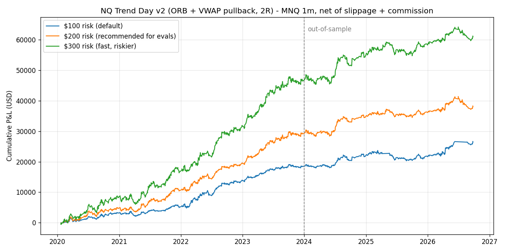
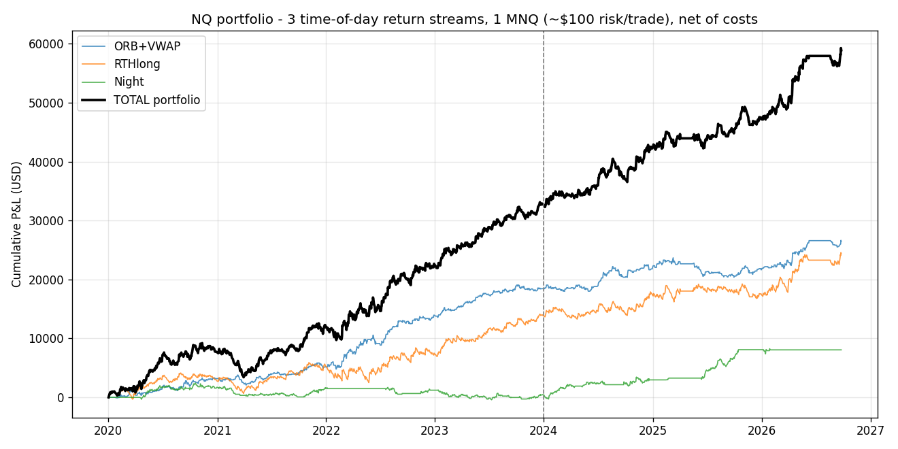

# NQ Trend Day v2: resultados de la investigación (MNQ, 1 minuto, 2020-01 → 2026-09)

**Datos:** 2.3 millones de velas de 1 minuto del Nasdaq-100 (1,740 sesiones). Costos incluidos: 1 tick de slippage por entrada y por salida de stop, y $1 de comisión ida y vuelta por contrato.

**Método:** 2020–2023 para diseñar y 2024–2026 para validar a ciegas. Cada estrategia se simuló vela a vela, tal como la ejecuta NinjaTrader. Además, el código C# final se replicó línea por línea en Python (`research/nt_v2_replica.py`).

## Qué se probó (12 familias)

| Familia | Veredicto |
|---|---|
| IFVG (tu indicador) | Sin edge ejecutable. El 76% de TradingView sale de fills que nunca ocurren |
| FVG / Silver Bullet / apertura / PM | Ruido. Un aparente edge era un sesgo de simulación |
| Barridas de liquidez, cierre de gap, última media hora | Negativas |
| ORB de Londres, ORB de tarde, ORB en S&P 500 | Negativas o inconsistentes |
| ORB pre-NY (noticias 8:30) | Descartada: solo gana dentro del pico de la noticia, donde el slippage es impredecible |
| Noise-Area momentum | Degradada en 2024–26 |
| **ORB NY 60 min + tendencia** | **Robusto: el 100% de 864 variantes es positivo fuera de muestra** |
| **Pullback al VWAP en días de tendencia** | **Robusto: el 100% de 80 variantes vecinas es positivo** |

## La estrategia: `NYOpeningRangeTrend` (NQ Trend Day v2)

**Sesgo diario:** cierre anterior contra la SMA de 20 cierres. Solo se opera a favor de esa tendencia.

**Módulo 1, ORB:**
- Rango de 09:30 a 10:30.
- Orden stop 1 tick fuera del rango, de 10:30 a 13:00.
- Stop en el lado opuesto del rango, con un máximo de 0.20 × ATR diario.
- Objetivo 2R.
- Se re-arma si el precio vuelve a cerrar dentro del rango. Máximo 2 trades por día.

**Módulo 2, VWAP:**
- Cuando el precio cierra fuera del rango y a ≥0.10 ATR del VWAP, pone una limit en el VWAP, que la sigue vela a vela hasta las 14:30.
- Stop de 0.20 ATR y objetivo 2R.
- 1 trade por día.

**Reglas generales:** todo cerrado a las 15:55 ET, y el día se detiene tras 2 pérdidas seguidas.

**Resultados (réplica exacta del código C#):**

| | Trades | Win rate | PF | R total |
|---|---|---|---|---|
| Total 2020–2026 | 1,414 (4.1/semana) | 46.7% | 1.36 | +251R |
| Entrenamiento 2020–23 | 884 | 47.3% | 1.42 | +187R |
| Validación 2024–26 | 530 | 45.7% | 1.25 | +65R |

| Año | 2020 | 2021 | 2022 | 2023 | 2024 | 2025 | 2026 (a sep) |
|---|---|---|---|---|---|---|---|
| R | +33.8 | +31.2 | +67.0 | +54.6 | +35.7 | −0.9 | +30.0 |

## Prop firm 50K (objetivo $3,000; trailing $2,000), empezando cualquier día

| Riesgo por trade | $/año | Pasa en ≤90 días | Falla en ≤90 días | Pasa en algún momento | Mediana de días hábiles |
|---|---|---|---|---|---|
| $100 (default) | $3,900 | 19% | 5% | 88% | 145 |
| **$200 (recomendado)** | **$5,700** | **42%** | **9%** | **83%** | **91** |
| $250 | $7,300 | 52% | 25% | 67% | 65 |
| $300 | $9,100 | 58% | 33% | 62% | 45 |

- **La velocidad para pasar = riesgo × edge × frecuencia.** No encontré ninguna estrategia robusta que pase un 50K en menos de un mes sin un riesgo alto de quemar la cuenta.
- **2025 fue plano:** −0.9R en todo el año. Hay semestres sin avance.
- **Con $100, en épocas de volatilidad alta la estrategia deja de operar.** Si 1 MNQ supera los $200 de riesgo, se salta el trade. Por eso hay tramos planos en el gráfico.

## Validar en NinjaTrader
1. En NinjaScript Editor pulsa **F5** para compilar. La v2 ya está copiada en tu carpeta Strategies.
2. En Strategy Analyzer configura:
   - Strategy: **NYOpeningRangeTrend**
   - Instrument: **MNQ ##-##**
   - Data series: **Minute 1**
   - Trading hours: **CME US Index Futures ETH**
   - Fechas: 2024-01-01 → hoy
   - Order fill resolution: **High / Tick 1**
   - Slippage: **1**
   - Include commission: **True**
   - Set order quantity: **Strategy**
   - Entries per direction: 1 y Entry handling: **UniqueEntries** (ya vienen así por defecto)
3. Los primeros ~20 días no opera: está calentando el ATR y la SMA.
4. Antes de la evaluación, 2–4 semanas en Sim101 en tiempo real.

## Actualización: win rate alto (≥70%) y meta de $150/día

**Búsqueda de win rate alto:** 840 variantes de reversión a la media (VWAP y media móvil; sesión NY y nocturna).
- 153 variantes tienen win rate ≥65%, y algunas llegan a 81%.
- **Ninguna gana dinero fuera de muestra** (PF < 1 después de costos).

**Lo que sí funciona: la ventaja validada con objetivo de 0.5R** (ahora es el default de la estrategia):

| Objetivo | Riesgo | Win rate | PF (validación 2024–26) | $ promedio/día | Días con ≥ $150 |
|---|---|---|---|---|---|
| **0.5R (default)** | $300 | **70.7%** | 1.19 | $12 | 14% |
| 1R | $300 | 56.4% | 1.23 | $25 | 26% |
| 2R | $300 | 46.5% | 1.21 | $35 | 23% |

**$150/día en 4 de 5 días no es alcanzable** con ninguna estrategia robusta de las ~6,000 configuraciones probadas en 12 familias.
- La estrategia opera ~50% de los días.
- Para promediar $150/día hace falta escala: 4–5 cuentas fondeadas copiando la versión 2R a $300 (Apex permite varias cuentas; Topstep hasta 5).
- Aun así, los días serán irregulares: muchos días sin trade y algunos días grandes.

## v3: portafolio profesional (3 flujos de retorno por horario)

**Pruebas nuevas descartadas:**
- **Arbitraje estadístico NQ/ES:** negativo en las 72 variantes. El costo de las dos patas supera la reversión.
- **Deriva por ventanas horarias:** 48 variantes. Solo sobrevivieron "RTH long" y "Night".

| Flujo | Estrategia | Correlación con ORB+VWAP | Años positivos |
|---|---|---|---|
| ORB + VWAP (`NYOpeningRangeTrend`) | Ruptura del rango y pullback a favor de la tendencia | — | 6/7 |
| RTH long (`NQSessionDrift`) | Compra 09:30, stop 0.2 ATR, sale 15:55 | 0.23 | **7/7 (incluido 2022)** |
| Night (`NQSessionDrift`) | Compra 18:00, stop 0.3 ATR, sale 08:00, solo si el cierre > SMA50 | ≈ 0 | 5/7 |

**Portafolio completo, 1 MNQ (~$100 de riesgo por trade):**
- **$34 por día ($8,564 por año), Sharpe 1.75, positivo los 7 años**, incluido 2025 (+$4,795).
- 43% de días verdes. Peor día: −$639.
- Drawdown máximo histórico: $5,795. En Monte Carlo a 1 año, el 95% de los escenarios queda en $5,370 o menos.

| Cuenta de evaluación | Pasa en ≤90 días | Falla en ≤90 días | Pasa en ≤180 días | Falla en ≤180 días |
|---|---|---|---|---|
| 50K (solo ORB+VWAP) | 19% | 5% | 52% | 10% |
| **50K (portafolio)** | **61%** | 28% | 68% | 32% |
| 100K (portafolio) | 14% | 9% | **66%** | **16%** |

**Uso:** en el mismo gráfico o cuenta, agrega `NYOpeningRangeTrend` y `NQSessionDrift`, las dos en MNQ, 1 minuto y horario ETH.

**$150 por día** = ~4–5 cuentas fondeadas corriendo el portafolio: $34 × 4.4 cuentas. Es un promedio, no 4 de 5 días fijos.

## Estudio 2026 (solo datos de 2026): eval 25K, 20 días, objetivo $1,500

**Diseño:** enero–mayo 2026. **Validación:** junio–septiembre 2026.

| Prueba (2026) | Variantes | Resultado |
|---|---|---|
| ICT Sweep + IFVG (PDH/PDL, overnight, Londres, Asia; mercado o retest; 1R–2R) | 8,225 | **0 variantes con win rate ≥70%**. Mediana PF 0.93 |
| IFVG, con TradingView asumiendo el fill | 24 | Win rate de hasta **81.5%** (1:1 NY): solo en el gráfico |
| El mismo IFVG con orden limit real | 24 | Win rate **42.4%**, PF 0.71 |
| Market Profile "regla del 80%" | 48 | Win rate 70–80%, pero PF 0.72 en 2026 |
| Selector adaptativo de 93 estrategias (walk-forward semanal) | 32 | El 88% pierde en validación |

**Régimen:** en junio–julio de 2026 el ATR diario pasó de ~430 a ~600 puntos y el NQ cayó. Las estrategias de tendencia que ganaban en enero–mayo perdieron en junio–septiembre.

**Probabilidad de pasar la eval 25K en ≤20 días** (mejor configuración: portafolio a $200–300 por trade):

| Objetivo / Drawdown | Pasa (2020–26) | Pasa (2026) | Falla (2026) |
|---|---|---|---|
| $1,500 / $1,200 | 45% | 48–51% | 47–48% |
| $1,200 / $1,200 | 51% | 53–56% | 44–45% |
| $1,500 / $1,500 | 49–52% | 51–57% | 41% |
| $1,200 / $1,500 | 56–59% | 57–61% | 37–40% |

Con ventaja cero, esas reglas ya dan ~44% de pasar. Ninguna estrategia robusta lleva eso cerca del 90% en 20 días.

**Fase fondeada 25K ($1,200 de drawdown), 1 MNQ:**

| Sistema | Promedio semanal | Semanas ≥ $400 | Quema la cuenta en ≤3 meses |
|---|---|---|---|
| Portafolio | $167–302 | 28–34% | 35–42% |
| ORB + VWAP | $75–124 | 15% | 0–17% |

Con la volatilidad de 2026, 1 MNQ mueve ~$800–1,200 por día: lo mismo que todo el drawdown de la cuenta.

## Ronda extra: machine learning y marcos de 5/15 minutos

**Machine learning (walk-forward estricto):**
- Gradient boosting con 34 variables de contexto (VWAP, rangos, barridas, FVG, hora, volatilidad, gap, tendencia).
- 111,000 puntos de decisión, entrenado solo con el pasado.
- Brackets 1:1: win rate 50–52%, PF 1.04 fuera de muestra (sin edge).
- Brackets amplios: PF 1.2–1.5 en 2023–2025, pero **2026 plano (PF 0.68–1.09)** y stops de ~190 puntos.

**IFVG y Sweep+IFVG en 5 y 15 minutos (ejecución real), 91 variantes:**
- Funcionaba en 2020–23 (PF 1.3–1.4).
- Se degradó en 2024–25 y en 2026 (PF 0.4–1.0).
- Solo 5 variantes son positivas en los 3 períodos, con muy pocos trades.

**Total acumulado:** más de 25,000 configuraciones en 15 familias, 3 marcos temporales y ML. Ninguna combina win rate ≥70% y ganancia neta de forma estable. La única ventaja que sobrevive varios años es la de tendencia (ORB + VWAP + drift), y en junio–septiembre de 2026 también se debilitó.

## Meta-labeling: 16 estrategias en 5 minutos + machine learning

**Estrategias base (5 minutos):**
- Rupturas: ORB 30/60, Donchian, PDH/PDL, inside bar, arranque de apertura.
- Tendencia: VWAP reclaim, cruce y pullback de EMA.
- Reversión: RSI(2), Bollinger, VWAP fade, gap fade.
- Barridas de PDH/PDL y overnight, e IFVG en 5 minutos.

**Resultado:**
- 87,000 señales en total. Ninguna de las 16 tiene ventaja por sí sola en trades 1:1 (win rate 46–53%, R promedio ≤ 0).
- El modelo de ML (gradient boosting con 38 variables, umbral calibrado en el año anterior) mejora 2023–2024 (PF 1.1–1.2), pero **no es estable**.
- En 2026: PF 0.91 con 1:1; con otros ratios, PF 0.49–1.41 sobre muy pocos trades.

| Configuración | Win rate fuera de muestra | PF fuera de muestra | PF 2026 |
|---|---|---|---|
| 1.5 ATR5, 1:1, 60 min | 52.1% | 1.05 | 0.91 |
| 3 ATR5, 1:1, 120 min | 52.5% | 1.10 | 1.41 (32 trades) |
| 1.5 ATR5, 1:2, 120 min | 44.9% | 1.13 | 1.06 (33 trades) |
| 3 ATR5, 1:2, 240 min | 50.9% | 1.24 | 0.49 (10 trades) |
| 2 ATR5, 1:1, 120 min | 51.7% | 1.00 | 0.65 |

## Libro de Robert Miner ("Estrategias de trading con altas probabilidades de éxito")

Estrategia de momentum en dos marcos temporales, programada con las reglas del libro:
- Oscilador DT (Stochastic RSI).
- Entrada Tr-1BH/L (stop 1 tick sobre la barra de señal) y stop en el swing.
- Salidas a 1R, 2R, con 2 unidades o solo trailing.
- 192 variantes, en sesión de 2 horas y sesión completa.

**Resultado:** la mediana no gana (PF 0.85–1.06). La mejor variante es 5m/15m, DT(13,8,5,5), 9:30–11:30, salida 1R:
- Win rate 51–55%, PF 1.03–1.21.
- Positiva en 5 de 7 años (negativa en 2023 y 2025).

El propio libro dice que ganar más del 50% de las operaciones "te pone entre la élite".

## Plan de 4 cuentas 25K fondeadas (1 MNQ por cuenta, riesgo ~$100–200 por trade)

| Plan | $ por semana (2020–26) | $ por semana (2026) | Semanas ≥ $400 | Riesgo de quemar en 3 meses (por cuenta) |
|---|---|---|---|---|
| 4 cuentas × ORB+VWAP (misma estrategia copiada) | ~$300 | ~$495 | 38–42% | 17% (2020–26) / 0% (2026). Si pasa, caen todas juntas |
| 2 × ORB+VWAP + 2 × Miner | ~$178 | ~$296 | 34–36% | 17% / 7% |
